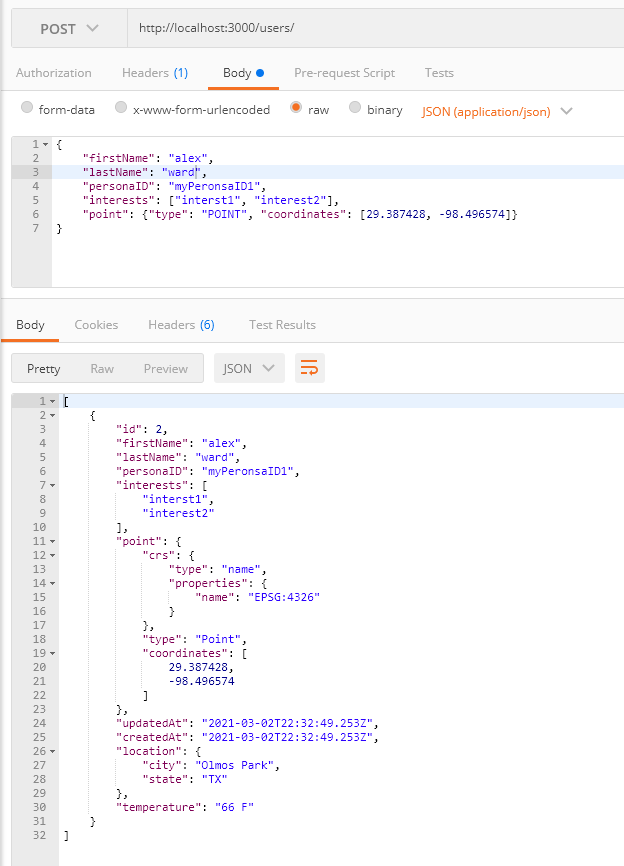

# Documentation


## Running the application
- `docker-compose up`

## API
- Domain: http://localhost:3000

| Route          	| Method 	| Description                          	|
|----------------	|--------	|--------------------------------------	|
| /users/        	| GET    	| List View - returns User[]           	|
| /users/        	| POST   	| Create View - creates & returns User 	|
| /users/\<id\>/ 	| GET    	| Retrieve View - returns User         	|
| /users/\<id\>/ 	| PUT    	| Update View - updates & returns User 	|
| /users/\<id\>/ 	| DELETE 	| Delete View - deletes user           	|
     
User Schema
```json
{
    "personaID": "<string>",
    "firstName": "<string>",
    "lastName": "<string>",
    "interests: "<string[]>",
    "point": {"type": "POINT", "coordinates": [<latitude - Float> , <longitude - Float>]}
}
```     
- Example:



## Questions
- Were you able to complete all the functionality in the time allotted?  If not, which pieces are outstanding?
    * Functionality should be complete.
    
- What potential issues do you see with your API, as implemented?  How would you address them?
    * There is no validation other than that it matches the User interface.  `Fix: ` Add some custom validators to handle model constraints. 
    * No pagination implemented on the list view; this will eventually cause us issues at the DB layer, as well as the weather.gov api w/ too many calls per second. `Fix: ` Add pagination
    * Database isn't persisted.  `Fix: ` Either mount a volume to store the postgres data to or use an external RBDMS.  
- What security limitations does your API have?
    * No Authentication layer.  
    * No Middleware to handle attacks
    * PK is auto-incremented and easy to guess.  Should have used UUIDs
    * No Filtering or RBAC.  Anyone can look at anyone's data.
    
- Time Spent
    * Spent a little more than the allotted time.  Since this was my first ever Express app, I had to do some research before starting.  Since I do all my frontend coding in Typescript/Javascript it wasn't much of a stretch other than learning the frameworks.  I typically do all my backends in Python. 